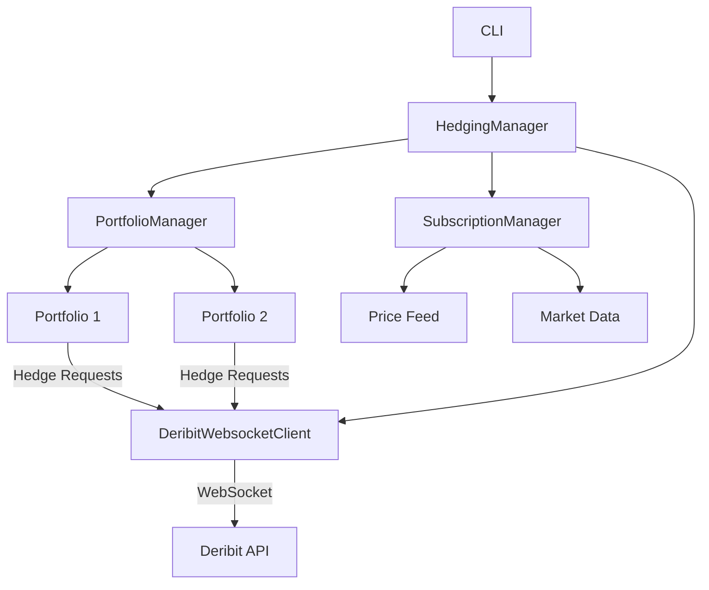

# DNEUTRAL SNIPER

[](https://opensource.org/licenses/MIT)
[](https://www.python.org/downloads/)

DNEUTRAL SNIPER is an advanced automated delta hedging system for options portfolios on the Deribit exchange. It provides robust risk management for options traders by maintaining delta neutrality through dynamic hedging.

## Features

- **Multi-Portfolio Management**: Manage multiple independent portfolios with different underlyings (BTC, ETH, etc.)
- **Real-time Delta Hedging**: Automatically hedge delta exposure using perpetual futures contracts
- **Advanced Risk Management**: Configurable delta thresholds, position sizing, and risk parameters
- **Dynamic Portfolio Monitoring**: Real-time tracking of portfolio metrics and hedging status
- **Flexible Configuration**: Customize hedging parameters and risk management rules
- **Robust Error Handling**: Automatic reconnection and error recovery mechanisms
- **Command-Line Interface**: Intuitive CLI for portfolio management and monitoring
- **Comprehensive Logging**: Detailed logging for auditing and debugging

## Installation

1. Clone the repository:
   ```bash
   git clone https://github.com/yourusername/dneutral-sniper.git
   cd dneutral-sniper
   ```

2. Create and activate a virtual environment (recommended):
   ```bash
   python -m venv venv
   source venv/bin/activate  # On Windows: venv\Scripts\activate
   ```

3. Install the package with dependencies:
   ```bash
   pip install -e .
   ```

4. Install development dependencies (for testing and development):
   ```bash
   pip install -e ".[dev]"
   ```

## Configuration

1. Copy and configure the example configuration file:
   ```bash
   cp config.example.json config.json
   ```

2. Edit `config.json` with your Deribit API credentials and preferred settings:
   ```json
   {
       "deribit": {
           "key": "YOUR_API_KEY",
           "secret": "YOUR_API_SECRET",
           "testnet": true
       },
       "portfolios_dir": "portfolios",
       "hedging": {
           "ddh_min_trigger_delta": 0.1,
           "ddh_target_delta": 0.0,
           "ddh_step_mode": "absolute",
           "ddh_step_size": 100.0,
           "price_check_interval": 2.0,
           "min_hedge_usd": 10.0
       }
   }
   ```

3. For production use, consider using environment variables for sensitive credentials:
   ```bash
   export DERIBIT_KEY=your_api_key
   export DERIBIT_SECRET=your_api_secret
   ```

## Usage

### Command-Line Interface

```bash
# Show help
dneutral --help

# Create a new portfolio with initial balance
dneutral create-portfolio my_btc_portfolio --underlying BTC --balance 10000

# List all portfolios (basic view)
dneutral list-portfolios

# List portfolios with detailed information
dneutral list-portfolios --detailed

# Add an option to a portfolio
dneutral add-option my_btc_portfolio --instrument BTC-30JUN23-30000-C --quantity 10 --strike 30000 --expiry 2023-06-30 --option-type call --contract-type option --mark-price 0.05 --iv 0.8 --usd-value 500 --delta 0.45 --current-price 28000

# Start delta hedging for a portfolio
dneutral start-hedging my_btc_portfolio

# Monitor all active hedgers in real-time
dneutral monitor

# Get detailed status of a specific portfolio
dneutral portfolio-status my_btc_portfolio

# Stop delta hedging for a portfolio
dneutral stop-hedging my_btc_portfolio

# Delete a portfolio (must be stopped first)
dneutral delete-portfolio my_btc_portfolio

# Run in testnet mode (override config)
dneutral --testnet monitor
```

### Common Workflow

1. **Initialize a new portfolio**:
   ```bash
   dneutral create-portfolio my_btc_portfolio --underlying BTC --balance 10000
   ```

2. **Add options positions**:
   ```bash
   dneutral add-option my_btc_portfolio --instrument BTC-30JUN23-30000-C --quantity 10 --strike 30000 --expiry 2023-06-30 --option-type call --contract-type option --mark-price 0.05 --iv 0.8 --usd-value 500 --delta 0.45 --current-price 28000
   ```

3. **Start hedging**:
   ```bash
   dneutral start-hedging my_btc_portfolio
   ```

4. **Monitor in real-time**:
   ```bash
   dneutral monitor
   ```

5. **Check portfolio status**:
   ```bash
   dneutral portfolio-status my_btc_portfolio
   ```

### Programmatic Usage

```python
import asyncio
from dneutral_sniper import (
    PortfolioManager, HedgingManager, SubscriptionManager,
    DeribitWebsocketClient, HedgerConfig
)

async def main():
    # Initialize components
    deribit_client = DeribitWebsocketClient(
        key="your_api_key",
        secret="your_api_secret",
        testnet=True
    )

    portfolio_manager = PortfolioManager(portfolios_dir="portfolios")
    await portfolio_manager.initialize()

    subscription_manager = SubscriptionManager()

    hedger_config = HedgerConfig(
        ddh_min_trigger_delta=0.01,
        ddh_target_delta=0.0,
        ddh_step_mode="percentage",
        ddh_step_size=0.01,
        price_check_interval=2.0,
        min_hedge_usd=10.0
    )

    hedging_manager = HedgingManager(
        portfolio_manager=portfolio_manager,
        subscription_manager=subscription_manager,
        deribit_client=deribit_client,
        default_hedger_config=hedger_config
    )

    # Start the hedging manager
    await hedging_manager.start()

    # Create a new portfolio
    await portfolio_manager.create_portfolio(
        portfolio_id="my_portfolio",
        underlying="BTC",
        initial_balance=10000.0
    )

    # Start hedging for the portfolio
    await hedging_manager.start_hedger("my_portfolio")

    # Monitor status
    stats = await hedging_manager.get_hedger_stats("my_portfolio")
    print(f"Current delta: {stats.get('current_delta', 0):.4f} BTC")

if __name__ == "__main__":
    asyncio.run(main())
```

## Architecture

DNEUTRAL SNIPER is built with a modular architecture for flexibility and maintainability:



### Core Components

1. **PortfolioManager**
   - Manages multiple portfolios and their persistence
   - Handles portfolio creation, updates, and deletion
   - Maintains position and balance information

2. **SubscriptionManager**
   - Manages real-time market data subscriptions
   - Handles price updates and market data distribution
   - Supports multiple data channels (tickers, books, trades)

3. **HedgingManager**
   - Coordinates delta hedging across multiple portfolios
   - Manages the lifecycle of DynamicDeltaHedger instances
   - Provides monitoring and control interfaces

4. **DynamicDeltaHedger**
   - Implements delta hedging logic for a single portfolio
   - Handles position sizing and order execution
   - Manages risk parameters and hedging thresholds

5. **DeribitWebsocketClient**
   - Handles WebSocket communication with Deribit
   - Manages authentication and reconnection
   - Provides clean interfaces for trading and market data

## Development

### Testing

Run the complete test suite:

```bash
pytest tests/
```

Run tests with coverage report:

```bash
pytest --cov=dneutral_sniper tests/
```

### Code Style

This project uses `black` for code formatting and `flake8` for linting:

```bash
# Format code
black .

# Check code style
flake8
```

### Type Checking

Run static type checking with `mypy`:

```bash
mypy dneutral_sniper
```

### Pre-commit Hooks

Install pre-commit hooks to automatically format and check your code:

```bash
pre-commit install
```

## License

This project is licensed under the MIT License - see the [LICENSE](LICENSE) file for details.

## Contributing

Contributions are welcome! Please follow these steps:

1. Fork the repository
2. Create a feature branch (`git checkout -b feature/amazing-feature`)
3. Commit your changes (`git commit -m 'Add some amazing feature'`)
4. Push to the branch (`git push origin feature/amazing-feature`)
5. Open a Pull Request

## Support

For support, please:
1. Check the [GitHub Issues](https://github.com/yourusername/dneutral-sniper/issues) for similar questions
2. If you don't find an answer, open a new issue with details about your problem

## Security

Please report any security issues to security@example.com. We take security seriously and will respond promptly.

## Disclaimer

This software is provided for educational and informational purposes only. Use at your own risk. The authors are not responsible for any financial losses incurred while using this software. Always test with small amounts in a controlled environment before using with real funds.

## Roadmap

- [ ] Support for additional exchanges
- [ ] Advanced order types (TWAP, VWAP)
- [ ] Performance analytics dashboard
- [ ] Backtesting framework
- [ ] Web-based management interface
